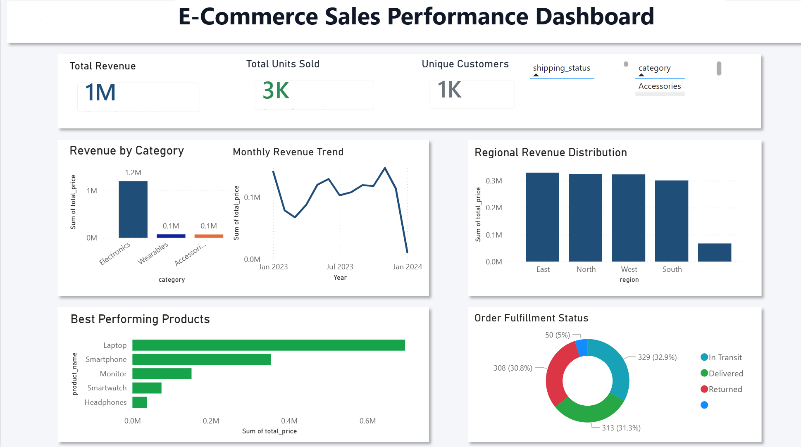

# E-Commerce Sales Analysis

## Dashboard

## Project Overview

This project analyzes e-commerce sales data to understand how different products, categories, and regions contribute to revenue over time. The goal is to move beyond basic sales summaries and extract practical insights about performance, demand concentration, and operational efficiency.
## Objective

The primary objective was to determine:

1. Which categories generate the highest revenue  
2. Which products contribute most to overall sales  
3. Which regions represent the strongest markets  
4. How revenue performance changes over time  

## Data Source

The dataset was sourced from https://www.kaggle.com/datasets/brsahan/e-commerce-dataset and downloaded locally as:
- E_commerce_dataset
  
## Workflow

### SQL (BigQuery)

- Validation checks (missing values, duplicates, consistency)  
- Standardization and cleaning  
- Structured aggregation across categories, products, and regions  
- Derived metrics (Total Revenue, Units Sold, Unique Customers)  

### Dashboard

- Category-level performance comparison  
- Regional revenue distribution  
- Monthly revenue trend visualization  
- Product performance ranking  
- Order fulfillment breakdown  

## Analytical Approach

Following data preparation, structured analysis was performed across:

- Revenue by category  
- Revenue by region  
- Monthly revenue trend  
- Best-performing products  
- Order fulfillment status  

## Key Findings 

- Electronics generates the majority of total revenue  
- A small number of products drive most sales  
- Revenue is concentrated in a few key regions  
- Sales fluctuate over time with noticeable peaks and drops  
- A significant portion of orders are returned or still in transit  

## Recommendations

- Focus on high-performing categories such as Electronics  
- Prioritize top-selling products to maximize revenue  
- Invest more in high-performing regions  
- Improve delivery and fulfillment processes  
- Stabilize revenue through consistent sales strategies  

## Repository Contents

/ecommerce_sales.sql

## Dashboard

[View on Power BI](https://app.powerbi.com/links/_H1wirBWHA?ctid=f89944b7-4a4e-4ea7-9156-3299f3411647&pbi_source=linkShare)  

## How to Reproduce (High Level)

1. Upload the CSVs in /data/raw to BigQuery.
2. Run the SQL scripts in /sql 
3. Connect Power BI to the final analytical table/view.
4. Build visuals and dashboard using the screenshots as reference.  

## Tools

SQL  
Google BigQuery  
Power BI  

## Professional Summary

Analyzed e-commerce sales data using SQL and dashboard tools, identified key revenue drivers, and delivered insights to support business decision-making.
